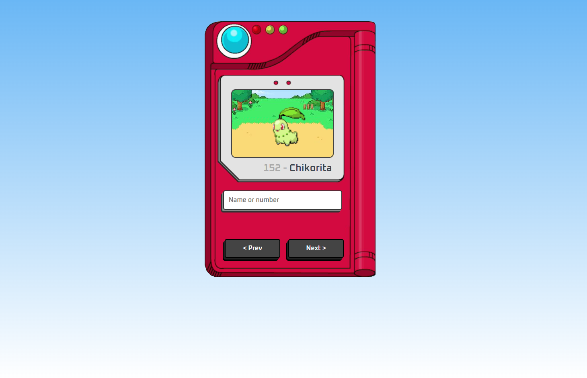
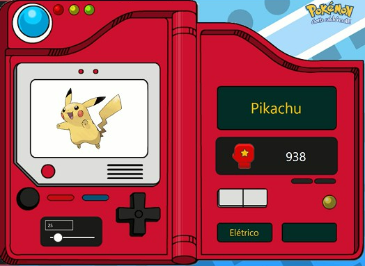

<h1 align="center">
   
  
   
  Pokedéx Interativa - Geração V
   
</h1>

<h4 align="center">Inspirado do universo fictício de Pokémon.</h4>

  <a href="#ferramentas">Ferramentas</a> •
  <a href="#projeto">Projeto</a> •
  <a href="#aprendizado">Aprendizado</a>

  

## Ferramentas

* HTML
  - Construção com formulário
* CSS
  - Flexbox
  - Positionamento absoluto e relativo
* JavaScript
  - Uso de API (PokéAPI)
  - Funções assíncronas
  

## Projeto

Foi uma releitura inspirada no famoso desenho "Pokémon", esta Pokédex foi desenvolvida para proporcionar uma experiência real e interativa aos fãs da quinta geração de Pokémon. 

Todo seu design foi projetado com base no estilo artístico do desenho, além da sua estética, a Pokedéx possui funcionalidades reais, permitindo que os usuários pesquisem números e nomes dos Pokémon da quinta geração. A interface intuitiva da Pokédex permite que os usuários realizem pesquisas de forma eficiente, inserindo números ou nomes de Pokémon. O processo é simplificado, tornando a interação fácil e acessível. Quando uma pesquisa é concluída com sucesso, o display da Pokédex ganha vida com um gif do Pokémon correspondente, proporcionando uma experiência visual envolvente. 

## Aprendizado

Durante esse processo, fui desafiado a integrar APIs pela primeira vez. A utilização da PokéAPI permitiu-me acessar dados atualizados sobre os personagens, enriquecendo a experiência do usuário com informações autênticas. Aprendi a estruturar e implementar chamadas assíncronas em JavaScript para garantir uma resposta rápida e eficiente na busca por informações.

Um dos pontos altos do projeto foi a implementação da exibição de GIFs dos Pokémon pesquisados no display da Pokédex. Isso exigiu uma combinação habilidosa de manipulação de DOM em JavaScript e técnicas de posicionamento no CSS. A interatividade adicionada, ao ver o Pokémon ganhando vida no display, elevou o projeto a um nível mais envolvente.

---

